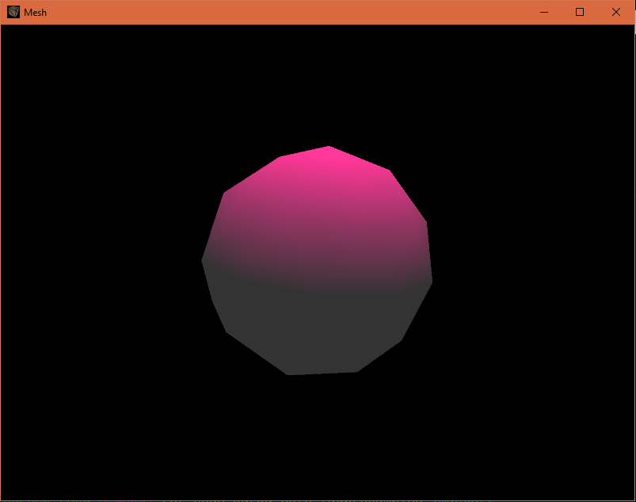

# Node.js 3D Core

This is a part of [Node3D](https://github.com/node-3d) project.

[](https://badge.fury.io/js/3d-core-raub)
[](https://www.codefactor.io/repository/github/node-3d/3d-core-raub)

```
npm i 3d-core-raub
```

Run **WebGL** code on **Node.js**.



> Note: Since version 4.0.0, [three.js](https://github.com/mrdoob/three.js) is a peer dependency.
Please install your version of choise and call `addThreeHelpers` before drawing frames.

* Multiple windows are supported, using [GLFW](http://www.glfw.org/) for window management.
* WebGL implementation is not 100% accurate, but good enough to run three.js examples.
* The C++ bindings use [GLEW](http://glew.sourceforge.net/) to access all the OpenGL functions.
* Image loading uses [FreeImage](http://freeimage.sourceforge.net/) encoder/decoder.
* Window icons are supported and both JS- and Image-friendly.

> Note: this package uses a bunch of **N-API addons**, which are ABI-compatible across
different Node.js versions. Addon binaries are precompiled and **there is no compilation**
step during the `npm i` command.


This module directly exports only one function - `init()`. Call it with or without
custom options to start with the first window and acquire all the features.

See [TypeSctipt defenitions](/index.d.ts) for more details.

Example:

```
const three = require('three');
const { init, addThreeHelpers } = require('3d-core-raub');

const { Screen, Brush, loop, gl } = init();
addThreeHelpers(three, gl);

const screen = new Screen();
loop(() => screen.draw());

const brush = new Brush({ screen, color: 0x00FF00 });
screen.on('mousemove', e => brush.pos = [e.x, e.y]);
```
