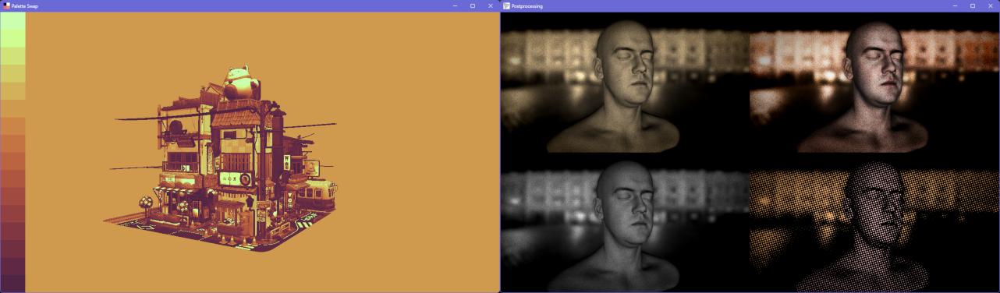

# Node.js 3D Core

This is a part of [Node3D](https://github.com/node-3d) project.

[](https://badge.fury.io/js/3d-core-raub)
[](https://github.com/node-3d/3d-core-raub/actions/workflows/eslint.yml)
[](https://github.com/node-3d/3d-core-raub/actions/workflows/test.yml)

```
npm i -s 3d-core-raub
```

Run **WebGL** code on **Node.js**.



> Note: Since version 4.0.0, [three.js](https://github.com/mrdoob/three.js) is a peer dependency.
Please install your version of choise and call `addThreeHelpers` before drawing frames.

* Multiple windows are supported, using [GLFW](http://www.glfw.org/) for window management.
* WebGL implementation is not 100% accurate, but good enough to run three.js examples.
* The C++ bindings use [GLEW](http://glew.sourceforge.net/) to access all the OpenGL functions.
* Image loading uses [FreeImage](http://freeimage.sourceforge.net/) encoder/decoder.
* Window icons are supported and both JS- and Image-friendly.

> Note: this package uses a bunch of **N-API addons**, which are ABI-compatible across
different Node.js versions. Addon binaries are precompiled and **there is no compilation**
step during the `npm i` command.


This module directly exports only one function - `init()`. Call it with or without
custom options to start with the first window and acquire all the features.

See [TypeSctipt defenitions](/index.d.ts) for more details.

Example (also see [here](/examples/crate-lean.js)):

```javascript
const three = require('three');
const { init, addThreeHelpers } = require('3d-core-raub');

const { doc, gl, requestAnimationFrame } = init({ isGles3: true });
addThreeHelpers(three, gl);

const renderer = new three.WebGLRenderer();
renderer.setPixelRatio( doc.devicePixelRatio );
renderer.setSize( doc.innerWidth, doc.innerHeight );

const camera = new three.PerspectiveCamera(70, doc.innerWidth / doc.innerHeight, 1, 1000);
camera.position.z = 2;
const scene = new three.Scene();

const texture = new three.TextureLoader().load(__dirname + '/three/textures/crate.gif');
texture.colorSpace = three.SRGBColorSpace;

const geometry = new three.BoxGeometry();
const material = new three.MeshBasicMaterial({ map: texture });
const mesh = new three.Mesh( geometry, material );
scene.add(mesh);

doc.addEventListener('resize', () => {
	camera.aspect = doc.innerWidth / doc.innerHeight;
	camera.updateProjectionMatrix();
	renderer.setSize(doc.innerWidth, doc.innerHeight);
});

const animate = () => {
	requestAnimationFrame(animate);
	const time = Date.now();
	mesh.rotation.x = time * 0.0005;
	mesh.rotation.y = time * 0.001;
	
	renderer.render(scene, camera);
};

animate();
```
