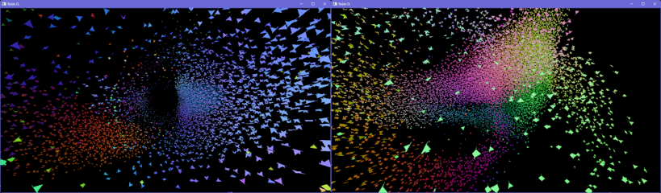

# Boids

> Boids is an artificial life simulation originally developed by Craig Reynolds.
The aim of the simulation was to replicate the behavior of flocks of birds.
Instead of controlling the interactions of an entire flock, however,
the Boids simulation only specifies the behavior of each individual bird.

```console
npm ci
npm run boids-gl
npm run boids-cl
```

This example uses the package "opencl-raub", so a separate `npm ci` needs to be run here.




* The original example was taken from Three.js examples
[GPGPU Birds](https://github.com/mrdoob/three.js/blob/master/examples/webgl_gpgpu_birds.html).
* The interop and some other notes for the OpenCL implementation were taken from this
[presentation](http://web.engr.oregonstate.edu/~mjb/cs575/Handouts/opencl.opengl.vbo.1pp.pdf).
* Some optimization ideas for the OpenCL demo were taken from this
[guide](https://developer.download.nvidia.com/compute/DevZone/docs/html/OpenCL/doc/OpenCL_Best_Practices_Guide.pdf)

The OpenCL implementation is similar to GLSL one algorithmically - i.e. the same N to N
interaction is performed. This is a basic example, not a grid-based N-body. It only
exists to illustrate how GLSL RTT compute can be swapped for OpenCL compute with Node3D.

## Minor changes

Compared to the original Three.js example there are several edits:
* Added OrbitControls - you may look around and zoom. The mouse-predator is only correct for the
initial view position.
* The birds are colored according to their flight direction. The background is black.
* Some GLSL changes, like removing the unused variables and improving readability.
* Extracted some functions and primitives into separate modules. Extracted the inline shaders.
* Removed the unused attributes. Renamed some of the variables.
* Bumped the number of birds from `32*32` to `128*128` (16k+).


## OpenCL notes

The positions memory contains `phase` similar to the GLSL implementation. The `velocity.w`
property is unused - we might as well use 3-component velocity.

It is possible to use OpenGL textures in OpenCL - to directly map the GLSL compute implementation.
But a more straightforward way of using shared VBOs was chosen. To implement that, the
birds mesh was adjusted for instancing. The changes are mostly related to how the
birds geometry is configured (see [GL](gl/bird-geometry.ts) vs [CL](cl/bird-geometry-cl.ts)).

The call to `cl.enqueueAcquireGLObjects` is only performed once. That works for a combination
of **Windows + nVidia**. It may turn out that on other platforms this should be called
every frame.

The naive implementation of N-body interaction performs similar in performance to GLSL -
because they do basically the same. I.e. the same number of GPU memory reads and writes,
and about the same math. But using shared/local GPU memory allows to optimize the number of
memory reads. By doing so, we can observe around x2 overall performance.

See [boids.cl](cl/boids.cl), where the first loop starts. The N-body interaction is split
into chunks of 256 items, and that is matched by the **work group** size when launching the
kernel.
1. For each iteration of the outer loop, the workgroup threads synchronize and
copy 256 entries into local memory (1 entry per thread).
1. Threads synchronize again, and each thread does 256 iterations,
but only reading from shared (and not **global**) memory.
1. Hence we use (the order of) N **global** reads, instead of N\*N. If N is **16384**, N\*N is **268,435,456**.
Although, we still do that amount of calculations either way.
